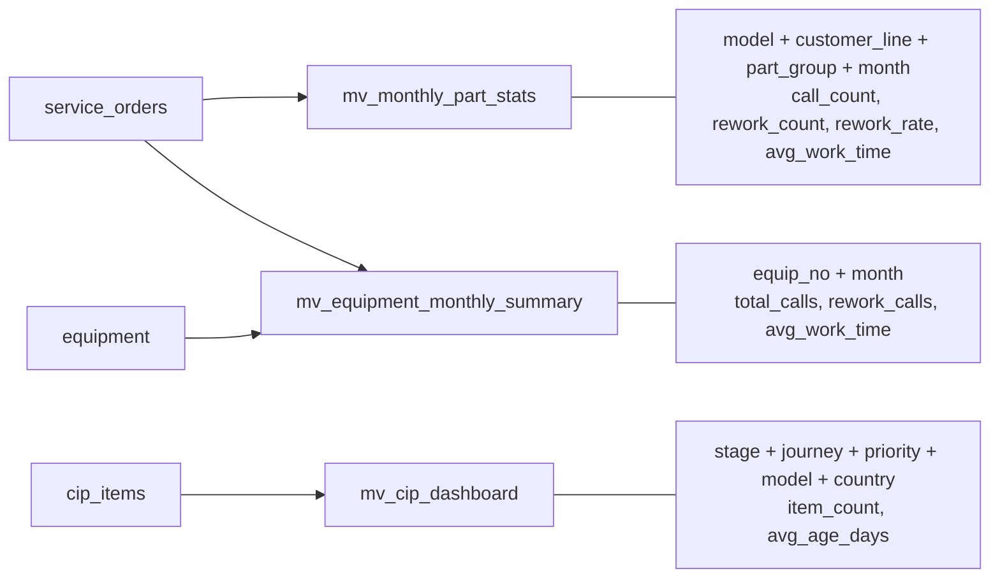
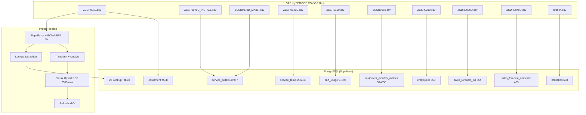

# myATHENA3 Database Schema

```mermaid
erDiagram
    %% ============================================================
    %% LOOKUP TABLES (Dimension)
    %% ============================================================
    lu_countries {
        text code PK
        text name_ko
        text name_en
    }
    lu_platforms {
        text code PK
        text name
    }
    lu_segments {
        text code PK
        text name
    }
    lu_models {
        text code PK
        text name
        text segment_code FK
        text platform_code FK
    }
    lu_customers {
        text code PK
        text name
        text country_code FK
    }
    lu_customer_lines {
        text code PK
        text name
        text customer_code FK
    }
    lu_work_centers {
        text code PK
        text name
        text plant
    }
    lu_business_types {
        text code PK
        text name
    }
    lu_act_types {
        text code PK
        text name
    }
    lu_cost_types {
        text code PK
        text name
    }
    lu_warranty_codes {
        text code PK
        text name
    }
    lu_priorities {
        text code PK
        text name
    }
    lu_order_types {
        text code PK
        text name
    }
    lu_sales_modes {
        text code PK
        text name
    }
    lu_defect_codes {
        text code PK
        text group_code
        text name
    }
    lu_cause_codes {
        text code PK
        text group_code
        text name
    }
    lu_damage_codes {
        text code PK
        text group_code
        text name
    }
    lu_activity_codes {
        text code PK
        text group_code
        text name
    }
    lu_material_groups {
        text code PK
        text name
    }
    lu_task_codes {
        text code PK
        text name
    }
    lu_part_groups {
        text code PK
        text name
    }

    %% Lookup hierarchy
    lu_models ||--o{ lu_segments : segment_code
    lu_models ||--o{ lu_platforms : platform_code
    lu_customers ||--o{ lu_countries : country_code
    lu_customer_lines ||--o{ lu_customers : customer_code

    %% ============================================================
    %% CORE SAP TABLES (Fact)
    %% ============================================================
    equipment {
        uuid id PK
        text equip_no UK "4568 rows"
        text sap_equip_no
        text wo
        text equip_id
        text model_code FK
        text country_code FK
        text customer_code FK
        text customer_line_code FK
        text business_type_code FK
        text platform_code FK
        text segment_code FK
        text work_center_code FK
        text sales_mode_code FK
        date shipping_date
        date fab_in_date
        date warranty_start
        date warranty_end
    }

    service_orders {
        uuid id PK
        text order_no UK "46957 rows"
        text order_type_code FK
        text equip_no "no FK"
        text model_code FK
        text country_code FK
        text customer_code FK
        text customer_line_code FK
        text business_type_code FK
        text act_type_code FK
        text cost_type_code FK
        text warranty_code FK
        text priority_code FK
        text work_center_code FK
        text defect_code "no FK"
        text cause_code "no FK"
        int total_task
        int total_working_time_min
        boolean rework
        date work_start_date
        date work_end_date
        text part_group_code "GENERATED"
    }

    service_tasks {
        uuid id PK
        text order_no "no FK, 236043 rows"
        text task_no
        text worker_id
        date record_date
        text task_code FK
        text act_type_code FK
        text cost_type_code FK
        text warranty_code FK
        text priority_code FK
        text work_center_code FK
        text equip_no "denormalized"
        text model_code "denormalized"
        text country_code "denormalized"
        text customer_line_code "denormalized"
        int work_time_min
        int total_min
        int moving_time_min
    }

    part_usage {
        uuid id PK
        text order_no "no FK, 91097 rows"
        text part_no
        text task_no
        text location_code
        date usage_date
        text part_path
        text material_group_new FK
        text equip_no "denormalized"
        text model_code "denormalized"
        text damage_code
        text activity_code
        int used_qty
    }

    equipment_monthly_metrics {
        uuid id PK
        text sap_equip_no "574050 rows"
        text year_month
        text division
        numeric value
        text model_code "denormalized"
        text country_code "denormalized"
        text customer_line_code "denormalized"
    }

    %% Core SAP relationships
    equipment ||--o{ lu_models : model_code
    equipment ||--o{ lu_countries : country_code
    equipment ||--o{ lu_customers : customer_code
    equipment ||--o{ lu_customer_lines : customer_line_code
    equipment ||--o{ lu_business_types : business_type_code
    equipment ||--o{ lu_platforms : platform_code
    equipment ||--o{ lu_segments : segment_code
    equipment ||--o{ lu_work_centers : work_center_code
    equipment ||--o{ lu_sales_modes : sales_mode_code

    service_orders ||--o{ lu_order_types : order_type_code
    service_orders ||--o{ lu_countries : country_code
    service_orders ||--o{ lu_business_types : business_type_code
    service_orders ||--o{ lu_customers : customer_code
    service_orders ||--o{ lu_customer_lines : customer_line_code
    service_orders ||--o{ lu_models : model_code
    service_orders ||--o{ lu_work_centers : work_center_code
    service_orders ||--o{ lu_act_types : act_type_code
    service_orders ||--o{ lu_cost_types : cost_type_code
    service_orders ||--o{ lu_warranty_codes : warranty_code
    service_orders ||--o{ lu_priorities : priority_code

    service_tasks ||--o{ lu_task_codes : task_code
    service_tasks ||--o{ lu_act_types : act_type_code
    service_tasks ||--o{ lu_cost_types : cost_type_code
    service_tasks ||--o{ lu_warranty_codes : warranty_code
    service_tasks ||--o{ lu_priorities : priority_code
    service_tasks ||--o{ lu_work_centers : work_center_code

    part_usage ||--o{ lu_material_groups : material_group_new

    %% Logical links (no FK constraint)
    service_orders }o--|| equipment : "equip_no (logical)"
    service_tasks }o--|| service_orders : "order_no (logical)"
    part_usage }o--|| service_orders : "order_no (logical)"
    service_tasks }o--|| employees : "worker_id (logical)"

    %% ============================================================
    %% NEW SAP TABLES
    %% ============================================================
    employees {
        uuid id PK
        text worker_id UK "350 rows"
        text name
        text name_eng
        text company_code
        text company_name
        text level
        date start_date
        date end_date
        text subsidiary
        text branch
        text country_code
        text job
        boolean is_active
    }

    branches {
        uuid id PK
        text customer_line_code UK "608 rows"
        text customer_line_name
        text office
        text country_code
    }

    sales_forecast_intl {
        uuid id PK
        text customer_code "554 rows"
        text customer_line_code
        text model_code
        text wo_planned
        text wo_actual
        text business_type_code
        int planned_qty
        numeric planned_price
        text currency
        text shipping_plan_ym
        int pm_count
    }

    sales_forecast_domestic {
        uuid id PK
        text wo "459 rows"
        text production_lot
        text plan_version
        text customer_code
        text customer_line_code
        text model_code
        text country_code
        date production_end_date
        int planned_qty
        date part_delivery_date
    }

    %% ============================================================
    %% CIP PLATFORM
    %% ============================================================
    cip_items {
        uuid id PK
        text cip_no UK "auto-generated"
        text stage "enum 12 stages"
        text journey_type "A or B"
        text action_priority
        text equip_no FK
        text model_code
        text target_part_group FK
        text assigned_engineer FK
        text assigned_manager FK
        text created_by FK
        uuid screening_result_id FK
        text title
        text root_cause
        jsonb effectiveness
        jsonb five_why
        jsonb fishbone
    }

    cip_stage_history {
        uuid id PK
        uuid cip_id FK
        text from_stage
        text to_stage
        text changed_by
    }

    cip_attachments {
        uuid id PK
        uuid cip_id FK
        text file_name
        text file_url
    }

    cip_comments {
        uuid id PK
        uuid cip_id FK
        text comment_type "enum"
        text content
    }

    cip_linked_orders {
        uuid id PK
        uuid cip_id FK
        text order_no FK
        text link_type "enum"
    }

    cip_test_plans {
        uuid id PK
        uuid cip_id FK
        text plan_type "enum"
        jsonb checklist
        text overall_result "enum"
    }

    cip_rollouts {
        uuid id PK
        uuid cip_id FK
        uuid ccb_id FK
        int total_target
        int completed
        text tier "enum"
    }

    cip_rollout_targets {
        uuid id PK
        uuid rollout_id FK
        text equip_no FK
        text status "enum"
    }

    cip_investigation_photos {
        uuid id PK
        uuid cip_id FK
        text uploaded_by FK
        text file_url
    }

    ccb_documents {
        uuid id PK
        text ccb_no UK
        text title
        text content
        text summary
        vector embedding "1024dim"
    }

    %% CIP relationships
    cip_items ||--o{ equipment : equip_no
    cip_items ||--o{ lu_part_groups : target_part_group
    cip_items ||--o{ screening_results : screening_result_id
    cip_items ||--o{ users : assigned_engineer
    cip_items ||--o{ users : assigned_manager
    cip_items ||--o{ users : created_by
    cip_stage_history }o--|| cip_items : cip_id
    cip_attachments }o--|| cip_items : cip_id
    cip_comments }o--|| cip_items : cip_id
    cip_linked_orders }o--|| cip_items : cip_id
    cip_linked_orders ||--o{ service_orders : order_no
    cip_test_plans }o--|| cip_items : cip_id
    cip_rollouts }o--|| cip_items : cip_id
    cip_rollouts ||--o{ ccb_documents : ccb_id
    cip_rollout_targets }o--|| cip_rollouts : rollout_id
    cip_rollout_targets ||--o{ equipment : equip_no
    cip_investigation_photos }o--|| cip_items : cip_id
    cip_investigation_photos ||--o{ users : uploaded_by

    %% ============================================================
    %% SCREENING & SUPPORT
    %% ============================================================
    screening_results {
        uuid id PK
        text year_month "272 rows"
        text model_code
        text customer_line_code
        text part_group_code FK
        text status "enum"
        int call_count
        numeric rework_rate
    }

    screening_hints {
        uuid id PK
        uuid screening_result_id FK
        text hint_text
    }

    so_descriptions {
        text order_no PK
        text desc_text
    }

    so_description_hints {
        uuid id PK
        text order_no FK
        text hint_type "enum"
        text desc_text
    }

    users {
        text id PK
        text name
        text email
        text role "enum"
    }

    notifications {
        uuid id PK
        text user_id
        uuid cip_id FK
        text type "enum"
        text title
        boolean is_read
    }

    import_logs {
        uuid id PK
        text tcode
        text file_name
        int row_count
        int success_count
        int error_count
        text status "enum"
    }

    screening_results ||--o{ lu_part_groups : part_group_code
    screening_hints }o--|| screening_results : screening_result_id
    so_descriptions }o--|| service_orders : order_no
    so_description_hints }o--|| service_orders : order_no
    notifications ||--o{ cip_items : cip_id
```

## Materialized Views

```mermaid
flowchart LR
    SO[service_orders] --> MV1[mv_monthly_part_stats]
    SO --> MV2[mv_equipment_monthly_summary]
    EQ[equipment] --> MV2
    CIP[cip_items] --> MV3[mv_cip_dashboard]

    MV1 --- D1["model + customer_line + part_group + month
    call_count, rework_count, rework_rate, avg_work_time"]
    MV2 --- D2["equip_no + month
    total_calls, rework_calls, avg_work_time"]
    MV3 --- D3["stage + journey + priority + model + country
    item_count, avg_age_days"]
```

## Data Flow (SAP Import)

```mermaid
flowchart TD
    subgraph SAP["SAP mySERVICE CSV (10 files)"]
        F1[ZCSR0010.csv]
        F2[ZCSR0070D_INSTALL.csv]
        F3[ZCSR0070D_MAINT.csv]
        F4[ZCSR0140D.csv]
        F5[ZCSR0100.csv]
        F6[ZCSR0150.csv]
        F7[ZCSR0210.csv]
        F8[ZSDR0030D.csv]
        F9[ZSDR0040D.csv]
        F10[branch.csv]
    end

    subgraph IMPORT["Import Pipeline"]
        PARSE[PapaParse + BOM/NBSP fix]
        LOOKUP[Lookup Extraction]
        TRANSFORM[Transform + Unpivot]
        UPSERT[Chunk Upsert RPC 2000rows]
        REFRESH[Refresh MVs]
    end

    subgraph DB["PostgreSQL (Supabase)"]
        T1[equipment 4568]
        T2[service_orders 46957]
        T3[service_tasks 236043]
        T4[part_usage 91097]
        T5[equipment_monthly_metrics 574050]
        T6[employees 350]
        T7[sales_forecast_intl 554]
        T8[sales_forecast_domestic 459]
        T9[branches 608]
        LU[22 Lookup Tables]
    end

    F1 --> PARSE --> LOOKUP --> LU
    PARSE --> TRANSFORM --> UPSERT
    F1 --> T1
    F2 --> T2
    F3 --> T2
    F4 --> T3
    F5 --> T4
    F6 --> T5
    F7 --> T6
    F8 --> T7
    F9 --> T8
    F10 --> T9
    UPSERT --> REFRESH
```
